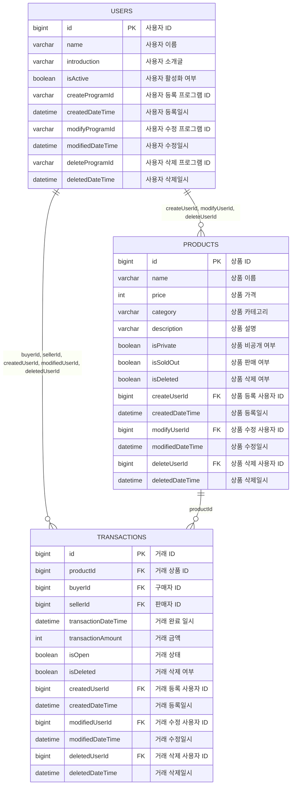

# ObjectsERD

> Written in Mermaid.js syntax  
> https://mermaid.js.org/syntax/flowchart.html

- vscode에서 다음 확장프로그램을 설치
  - Mermaid Markdown Syntax Highlighting : 마크다운 텍스트 문서에서 신택스 린팅
  - Mermaid Graphical Editor : 마크다운 코드블럭을 mermaid로 지정하면 상단에 GUI 에디터로 이동할 수 있는 "MermaidEditor" 표시

## Users, Products, Transactions
